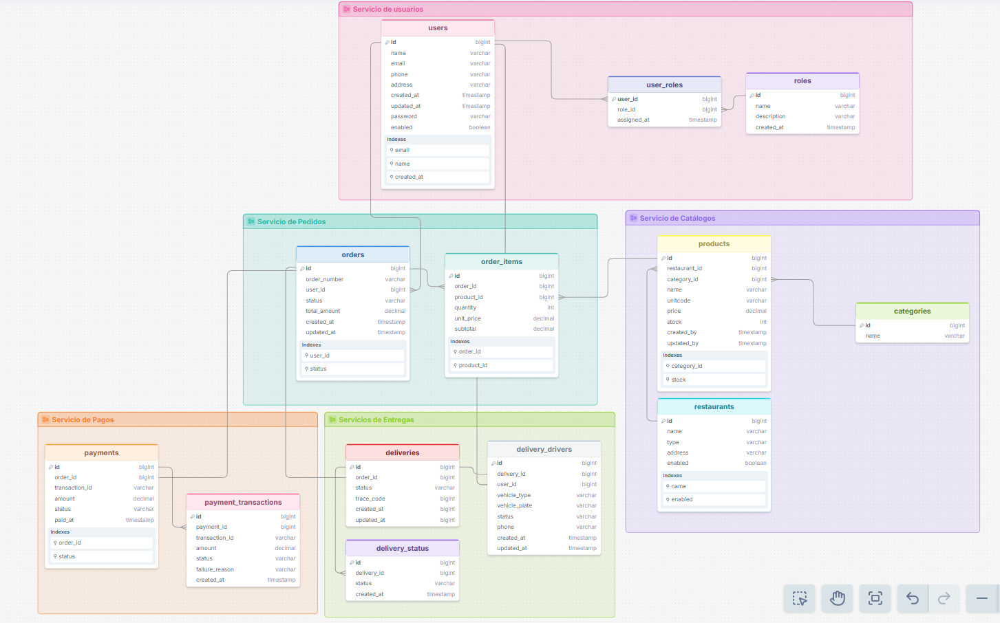
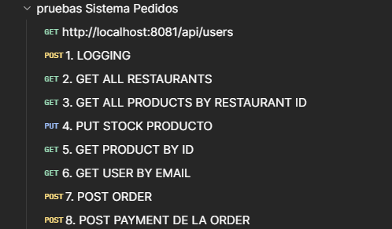
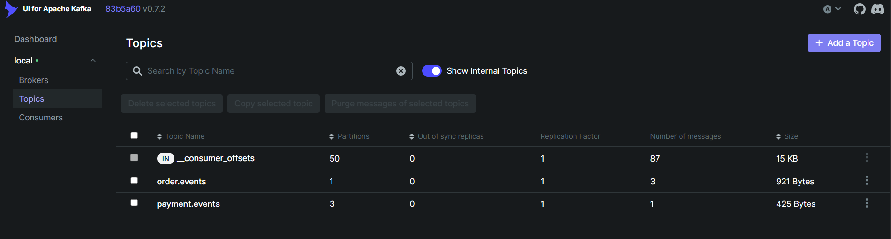
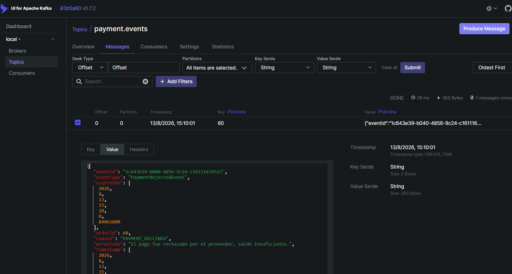
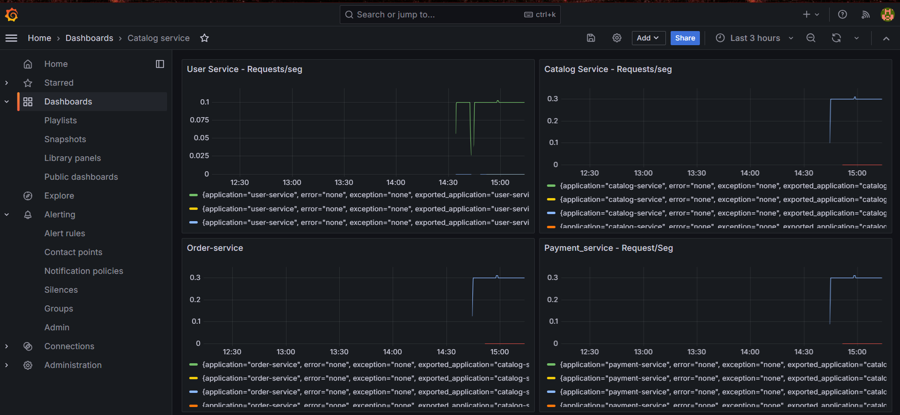
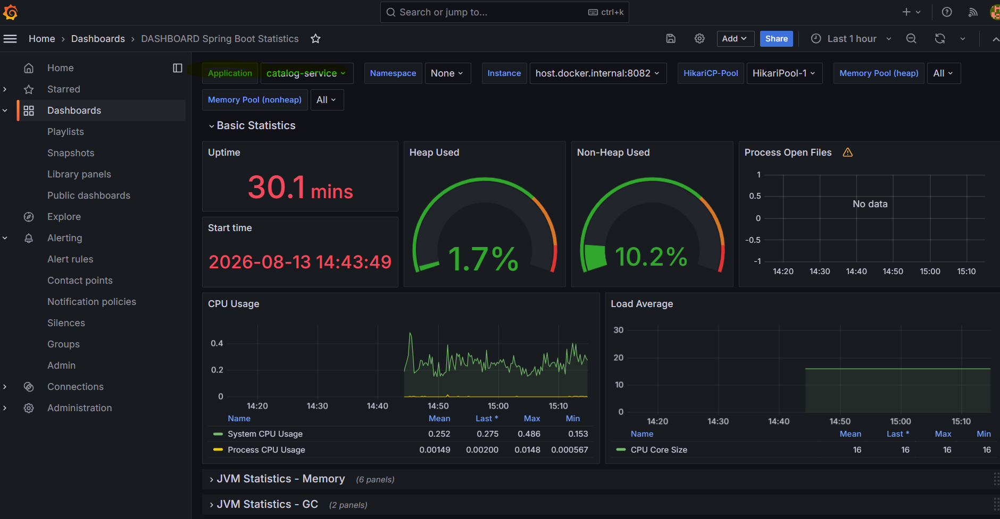
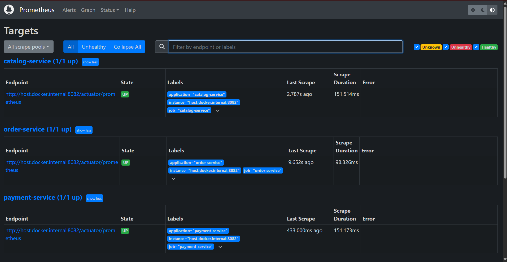
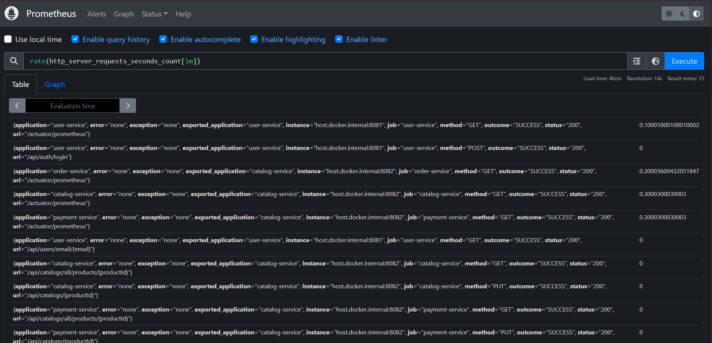
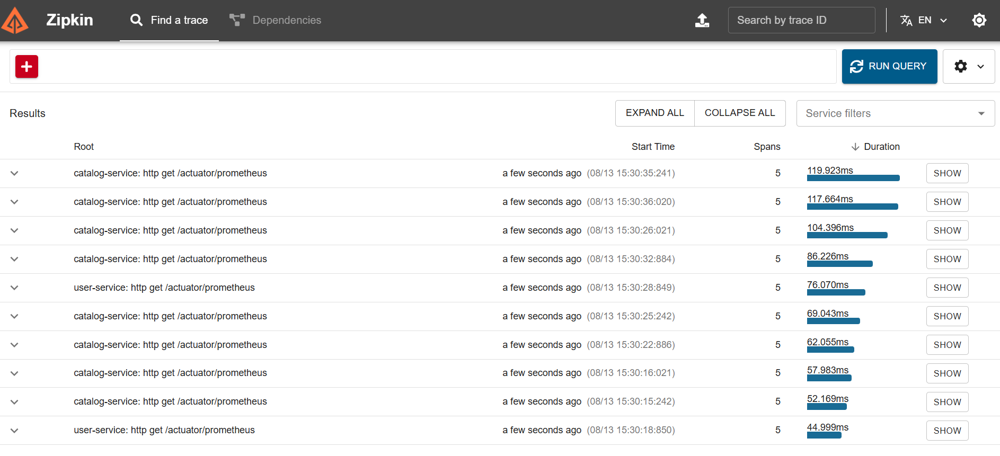

# 📄 TRABAJO: ORDER SERVICE (KUBERNETES)
 


## 🎯 OBJETIVO

Desarrollar un sistema de gestión de pedidos para múltiples restaurantes, basado en microservicios.

---

## 📋 DESCRIPCIÓN

En una arquitectura de microservicios para un sistema de pedidos de comida desde diferentes restaurantes, se requiere implementar el servicio de gestion de pedidos y coordinacion de entregas.
Los servicios principales son:

1. **Servicios de usuarios** permite generar los tokens y consultar los usuarios y sus roles.
Para la manipulacion de servicios se manejan los sgtes roles: CLIENT, ADMIN, RESTAURANT_MANAGER, DRIVER

2. **Servicios de Catálogos** consulta y actualiza el catalogo de restaurantes, productos y el stock de platos disponibles. 
3. **Servicios de Pedidos** gestiona la creación de ordenes en estado PENDING y dispara la actualización de stock de productos.
4. **Servicio de Pagos** registra y actualiza los pagos realizados y actualiza el estado del pedido a pago verificado o pago anulado.
5. **Servicios de Entregas** registra la traza del envio y actualiza el estado del pedido a entregado o no se entrego.

---

## 🏗️ ARQUITECTURA DEL SISTEMA

### Arquitectura Completa
```
┌─────────────────────────────────────────────────────────────┐
│               ARQUITECTURA COMPLETA                         │
└─────────────────────────────────────────────────────────────┘

     ┌────────────┐ ┌────────────┐ ┌────────────┐ ┌────────────┐ ┌────────────┐
     │   User     │ │  Catalog   │ │   Order    │ │  Payment   │ │  Delivery  │
     │  Service   │ │  Service   │ │  Service   │ │  Service   │ │  Service   │
     │   :8081    │ │   :8082    │ │   :8083    │ │   :8084    │ │   :8085    │
     └──────┬─────┘ └──────┬─────┘ └──────┬─────┘ └──────┬─────┘ └──────┬─────┘
            │              │              │              |              |
            │              │              │              |              |
            ▼              ▼              ▼              ▼              ▼
       ┌────────┐     ┌─────────┐    ┌────────┐   ┌──────────┐    ┌───────────┐
       │userdb  │     │catalogdb│    │orderdb │   │paymentdb │    │deliverydb │ 
       │ :5434  │     │ :5440   │    │ :5442  │   │ :5443    │    │ :5444     │
       └────────┘     └─────────┘    └────────┘   └──────────┘    └───────────┘

COMUNICACIÓN:
Catalog Service ──(HTTP )──► User Service (validación del rol y estado para actualizar inventario)
Order Service ──(HTTP )──► Catalog Service (verificación y actualización de stock)
Order Service ──(Kafka )──► Payment Service (verificación y actualización de orden)
Order Service ──(Kafka )──► Delivery Service (verificación y actualización de envío)
```

### Flujo de Datos
```
┌─────────────────────────────────────────────────────────────┐
│  FLUJO: Crear Orden                                         │
└─────────────────────────────────────────────────────────────┘

User (cliente)
  │
  │ POST /api/orders
  │ { userId: 1, items: [...] }
  ▼
Order Service
  │
  ├─----------------------─► Product Service
  │                          GET /api/products/1
  │                          ✅ Producto válido + precio
  │
  ├─► Calcular totales
  │   quantity × unit_price = subtotal
  │   Σ subtotals = total_amount
  │
  ├─► Guardar en orderdb
  │   INSERT INTO orders (...)
  │   INSERT INTO order_items (...)
  │
  ▼
Respuesta 201 Created
{
  "id": 1,
  "orderNumber": "ORD-2025-001",
  "user": { ... },
  "items": [ ... ],
  "totalAmount": 2599.98
}
```

---

## 📊 MODELO DE DATOS

### Diagrama Entidad-Relación



  


### Script SQL
```sql
Se localizan los scripts en cada microservice en la ruta /database
Se está considerando data inicial para:
- users
- roles
- user-roles
- products
- categories
- restaurants

Asimismo los ms utilizan sequencias de postgress como parte de sus ids generados. 
```

---

## 🎯 REQUERIMIENTOS FUNCIONALES

### Endpoints Disponibles
Se ha colocado el archivo POSTMAN de las peticiones en la ruta /postman




### RF-01: Crear Orden de Compra
- Para pasar una orden de compra es necesario ejecutar el **Endpoint 1. LOGGING**
- Con el token generado de un usuario cliente, proceder al registro de la orden en el **Endpoint 7. POST ORDER**

```json
ADMIN:
{"email":"juan.perez@example.com",
"password":"admin123"}

CLIENT:
{"email":"maria.garcia@example.com",
"password":"user123"}
{"email":"roberto.sanchez@example.com",
"password":"user123"}

ROLE_RESTAURANT_MANAGER:
{"email":"carlos.lopez@example.com",
"password":"admin123"}
{"email":"ana.torres@example.com",
"password":"admin123"}

DRIVER:
{"email":"julio.paredes@example.com",
"password":"user123"}
{"email":"luis.ruiz@example.com",
"password":"user123"}

```

**Request de la orden:**
para que el cliente realice el pedido solo debe indicar la lista de productos y la cantidad, el sistema tomará su nro de user al correr la validación con su token de sesión y consultar los usuarios asociados a su correo de token.
```json
{
   "items":[{
      "productId":"1",
      "quantity":2
   },{
      "productId":"2",
      "quantity":1
   }]
}
```

**Response (201 Created):**
```json
{
   "id": 60,
   "orderNumber": "ORD-2026-59",
   "userId": 5,
   "items": [
      {
         "id": 1,
         "product": {
            "id": 1,
            "name": "Vaso Agua de Jamaica",
            "unitcode": "ONZ",
            "price": 12.00,
            "restaurant": {
               "id": 1,
               "name": "El Bigotes",
               "type": "Mexican food",
               "address": "Jr los Alamos 312, callao"
            },
            "category": {
               "id": 1,
               "name": "Beverages"
            }
         },
         "quantity": 2,
         "unitPrice": 12.00,
         "subtotal": 24.00
      },
      {
         "id": 2,
         "product": {
            "id": 3,
            "name": "Enchilada de pollo",
            "unitcode": "UND",
            "price": 38.00,
            "restaurant": {
               "id": 1,
               "name": "El Bigotes",
               "type": "Mexican food",
               "address": "Jr los Alamos 312, callao"
            },
            "category": {
               "id": 2,
               "name": "Main dish"
            }
         },
         "quantity": 2,
         "unitPrice": 38.00,
         "subtotal": 76.00
      }
   ],
   "status": "PENDING",
   "totalAmount": 100.00,
   "createdAt": "2026-08-13T14:51:19.9024146"
}
```

**Proceso del sistema:**

**Registro Orden:**
1. Para cada item:
   - Validar producto mediante REST al Catalog-Service
     (este proceso usa un circuit breaker si el producto no se encuentra)
   - Obtener precio actual
   - Calcular subtotal
2. Calcular total de la orden
3. Generar número de orden único
4. Guardar en BD y actualizar stock en tabla products
5. Retornar orden completa
6. Inscribir el evento en order.events kafka

### RF-02: Realizar Pago de la Orden
- Para pagar una orden de compra es necesario el token generado en el **Endpoint 1. LOGGING**
- Con el token generado de un usuario cliente, proceder al registro del pago con el **Endpoint 8. POST PAYMENT DE LA ORDER**


**Request del pago:**
para que el cliente realice el pago del pedido, sólo indicara su orden y monto.
```json
{
  "orderId":"60",
  "amount":100
}
```

**Response (201 Created):**
```json
{
  "id": "1",
  "orderId": 60,
  "amount": 100,
  "status": "REJECTED",
  "transactionId": null,
  "paidAt": "2026-08-13T15:09:56.9480947"
}
```

**Proceso del sistema:**

**Registro del pago:**
1. Después de ejecutar **Endpoint 8. POST PAYMENT DE LA ORDER** registrar el evento en Kafka payment.events si fue exitoso o rechazado
2. El pago tiene un random para fallar o ser exitoso
3. Si el pago fue exitoso, generar un transaction_id y registrarlo en payments y payment_transactions.
4. Si el pago falló, se registra y actualiza el estado de  REJECTED y su detalle en payments y payment_transactions.
5. Actualizar el estado de la orden a CONFIRMED o CANCELED, respecto al resultado del payment mediante el consumo del evento kafka "payment.events".
---

## * MONITOREO 

KAFKA:
http://localhost:8090/




--levantar observabilidad
docker compose -f docker-compose-observability.yml up -d

--verificar contenedores
docker ps --format "table {{.Names}}\t{{.Status}}\t{{.Ports}}"

GRAFANA:
http://localhost:3000/dashboards
Dashboard de todos los ms:

Dashboard Spring Boot Stadistics (por Ms)


PROMETHEUS:
http://localhost:9090
```json
# Query 1: Total de requests por servicio
http_server_requests_seconds_count

# Query 2: Tasa de requests por segundo
rate(http_server_requests_seconds_count[1m])

# Query 3: Latencia p95 de cada endpoint
histogram_quantile(0.95, sum(rate(http_server_requests_seconds_bucket[5m])) by (le, uri, application))

# Query 4: Conexiones de base de datos activas
hikaricp_connections_active

# Query 5: Memoria JVM usada (%)
jvm_memory_used_bytes{area="heap"} / jvm_memory_max_bytes{area="heap"} * 100

# Query 6: Errores 5xx
sum(rate(http_server_requests_seconds_count{status=~"5.."}[5m])) by (application)
```




ZIPKIN:
http://localhost:9411/zipkin

---
## * DESPLIEGUE

**NOTA: Cómo desplegar cada MS en K8s:**

- Compilar el proyecto (si es necesario):

mvn clean package -DskipTests

- Construir imagen Docker:

docker build -t order-service:1.0 .

- Configurar Contexto para Docker Desktop

kubectl config use-context docker-desktop

- Actualizar el Secret con las nuevas variables de entorno codificadas en base64 (en la ruta order-service)

kubectl apply -f k8s\

- Cotejar que pods se han desplegado:

kubectl -n order-service get pods

- Reiniciar el despliegue para aplicar los cambios (opcional, ya que kubectl apply debería manejarlo)

kubectl rollout restart deployment order-service -n order-service

---

**NOTA: Cómo ejecutar peticiones:**
- Se actualizó el Docker Desktop a una version que solo usa KIND o KUBEADMIN para K8s.
- Se utilizó KIND que tiene mapeo por nodos internamente y no es visible las imagenes en el docker desktop directamente, por ello se agregó el "imagePullPolicy: IfNotPresent".
- La otra opción para este comando de port-forward es el mapeo de un ingress.yaml y la instalación de un nginx.

- Ejecutar los sgtes comandos, cada uno en una terminal, no cerrar el terminal para poder ejecutar las invocaciones:


- kubectl port-forward -n user-service svc/user-service 8081:80
- kubectl port-forward -n catalog-service svc/catalog-service 8082:80
- kubectl port-forward -n order-service svc/order-service 8083:80
- kubectl port-forward -n payment-service svc/payment-service 8084:80

---
## * TROUBLESHOOTING:

**Problemas de Memoria y CPUS:**

- Usando la version docker-desktop kind, 10 nodes, v1.34.8
Se amplia la configuracion WSL2 base desde powershell para un equipo de 16Gb hasta en 10 CPUS: 

notepad $env:USERPROFILE\.wslconfig

```json
  [wsl2]
  memory=10GB # Limits VM memory in WSL 2 to 4GB
  processors=10 # Limits the number of processors to 2
```
**Problemas de PullImage en k8s:**

- Para los problemas de image Pull al desplegar, considerar que Kind requiere cambiar el parametro de carga de imagen en el 03-deployment.yaml al valor "IfNotPresent":


```json
          # imagePullPolicy:
          # - Never: Solo usar imagen local (desarrollo)
          # - Always: Siempre descargar (producción)
          imagePullPolicy: IfNotPresent
```
